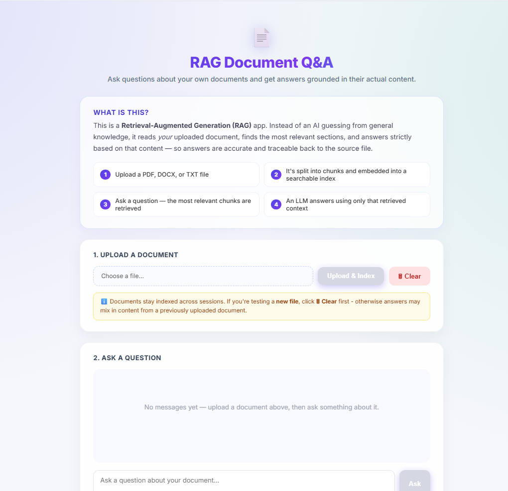
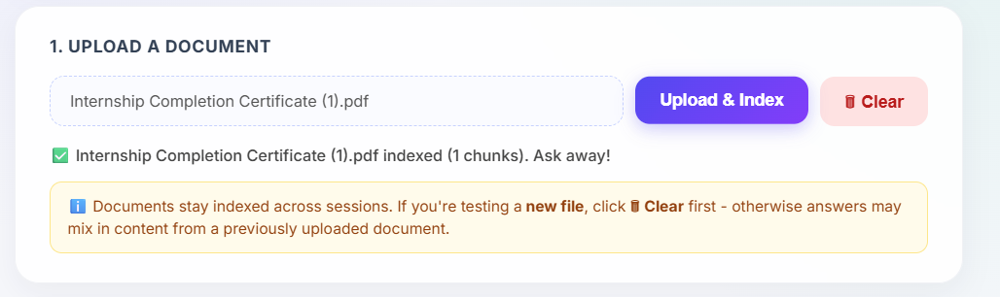
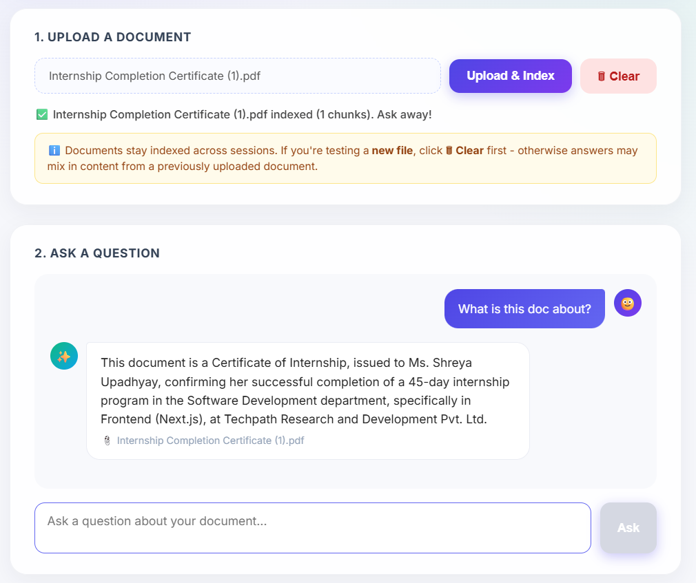

# RAG Document Q&A System
> Upload any document and get accurate, source-grounded answers to your questions — powered by Retrieval-Augmented Generation.

---

## 📌 Table of Contents
- [Overview](#-overview)
- [Features](#-features)
- [Tech Stack](#-tech-stack)
- [Architecture](#-architecture)
- [Screenshots](#-screenshots)
- [Installation](#-installation)
- [Environment Variables](#-environment-variables)
- [Usage](#-usage)
- [Folder Structure](#-folder-structure)
- [API Endpoints](#-api-endpoints)
- [Challenges Faced](#-challenges-faced)
- [Future Improvements](#-future-improvements)
- [Contributing](#-contributing)
- [License](#-license)
- [Author](#-author)

---

# 📖 Overview
Most chatbots answer from general training knowledge, which means they can't answer questions about *your* specific documents and are prone to hallucination when asked to.

This project solves that by implementing a **Retrieval-Augmented Generation (RAG)** pipeline: it reads an uploaded PDF/DOCX/TXT file, breaks it into chunks, embeds those chunks into a searchable vector index, and — when a question is asked — retrieves only the most relevant chunks and passes them to an LLM to generate an answer grounded strictly in that content.

**Who it's for:** anyone who needs quick, accurate answers from a document — students studying notes, professionals reviewing reports, or recruiters/reviewers wanting a fast way to query a resume or spec sheet — without manually searching through pages of text.

**How it works, in short:** Upload → Chunk → Embed → Store in vector DB → Retrieve relevant chunks on a question → LLM answers using only that retrieved context, with the source file cited.

---

# ✨ Features
- Upload PDF, DOCX, or TXT documents directly from the browser
- Automatic chunking and embedding — no manual preprocessing needed
- Fast semantic search over document content using a vector database
- Context-grounded answers (reduces hallucination vs. a plain chatbot)
- Source attribution — every answer shows which file it came from
- One-click index reset to clear old documents before testing new ones
- Fully open-source, free-tier-friendly stack (no paid APIs required)
- Clean, modern chat-style interface

---

# 🛠️ Tech Stack

## Frontend
- React (Vite)
- Custom CSS (no framework dependency)

## Backend
- FastAPI (Python)
- Uvicorn (ASGI server)

## Database
- ChromaDB (persistent local vector store)

## AI/ML
- LangChain (orchestration)
- HuggingFace Sentence-Transformers (`all-MiniLM-L6-v2`) for embeddings
- Groq (LLaMA 3.3 70B) for answer generation

## Tools
- Git & GitHub
- VS Code
- Render (backend hosting)
- Vercel (frontend hosting)

---

# 🏗️ Architecture
```text
                User
                  │
                  ▼
           Frontend (React)
                  │
                  ▼
          Backend (FastAPI)
                  │
     ┌────────────┴─────────────┐
     ▼                          ▼
 Vector Database             LLM API
  (ChromaDB)                 (Groq)
     ▲
     │
Local Embeddings
(sentence-transformers)
```

**Flow:**
1. User uploads a document via the React frontend.
2. FastAPI backend splits it into ~1000-character overlapping chunks.
3. Each chunk is embedded locally (no API call needed) and stored in ChromaDB.
4. When a question is asked, the same embedding model encodes the question, and ChromaDB returns the most semantically similar chunks.
5. Those chunks + the question are sent to Groq's LLM, which generates an answer using only that context.
6. The answer and its source filename are returned to the frontend.

---

# 📷 Screenshots
### Home Page


### Upload & Chat


### Answer with Source



---

# 🚀 Installation

## Clone Repository
```bash
git clone https://github.com/<your-username>/rag-doc-qa.git
```

## Move to Project
```bash
cd rag-doc-qa
```

## Backend Setup
```bash
cd backend
python -m venv venv
# Windows
venv\Scripts\activate
pip install -r requirements.txt
uvicorn main:app --reload
```

## Frontend Setup
```bash
cd frontend
npm install
npm run dev
```

---

# 🔑 Environment Variables
Create a `.env` file inside the `backend` folder:
```env
GROQ_API_KEY=your_groq_api_key_here
```
Get a free Groq API key at: https://console.groq.com/keys

---

# 💻 Usage
1. Start the backend server (`uvicorn main:app --reload`).
2. Start the frontend (`npm run dev`).
3. Open the app in your browser (default: `http://localhost:5173`).
4. Upload a PDF, DOCX, or TXT file and click **Upload & Index**.
5. Type a question about the document and press **Ask**.
6. View the answer along with the source file it was drawn from.
7. Click **Clear** before uploading a new document to avoid mixed results from previously indexed files.

---

# 📡 API Endpoints

| Method | Endpoint | Description |
|---------|----------|-------------|
| GET | /health | Health check + index status |
| POST | /upload | Upload and index a document |
| POST | /ask | Ask a question about indexed documents |
| POST | /reset | Clear all indexed documents |

---

# ⚡ Challenges Faced
- Handling rapid version changes across the LangChain ecosystem (deprecated `RetrievalQA` chains, relocated `text_splitter` and `HuggingFaceEmbeddings` modules) required rewriting the retrieval logic to a version-stable, dependency-light approach.
- Free-tier LLM API quota restrictions (Gemini) required switching to Groq for reliable, no-billing-required inference.
- Windows file-locking prevented direct filesystem deletion of the Chroma index on reset; resolved by using Chroma's own `delete_collection()` method instead of external file removal.
- Ensuring old indexed documents didn't bleed into answers for newly uploaded files — solved with an explicit reset/clear endpoint and UI warning.

---

# 📈 Future Improvements
- User authentication and per-user document isolation
- Streaming responses for faster perceived answer generation
- Multi-document comparison and cross-referencing
- Support for additional file types (e.g., PPTX, CSV, scanned/OCR PDFs)
- Persistent cloud vector storage for production use (currently local/ephemeral on free hosting tiers)
- Chat history export

---

# 🤝 Contributing
Contributions are welcome!
1. Fork the repository.
2. Create a new branch.
3. Commit your changes.
4. Push the branch.
5. Open a Pull Request.

---

# 📄 License
This project is licensed under the MIT License.

---

# 👩‍💻 Author
**Shreya Upadhyay**
- GitHub: https://github.com/<your-username>
- LinkedIn: https://linkedin.com/in/<your-profile>
- Email: your@email.com